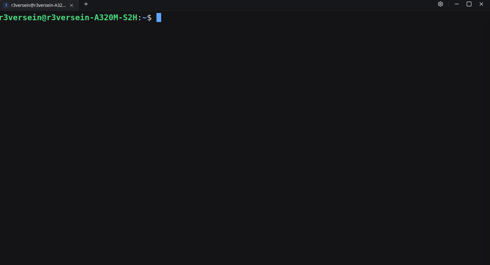

# aterm — modern Tauri terminal

> Frameless, tabbed terminal with built-in per-tab localhost HTTP API for AI agents. Each tab’s `port is the tab id` — share via right-click, `curl` the same PTY you see.


*Frameless 38px tabbar (`#16171a`), `aterm-dark (#141416)` / `aterm-light` / `nord (#2e3440)`.*

## Features

- **Tabs + PTY** — `portable-pty 0.8` `pty.rs:112` spawns `$SHELL → bash → sh`, `80×24` default, `SIGWINCH` on resize, `512KB` ring `OUTPUTS`, `pty:data:{id}`/`pty:exit:{id}`.
- **Frameless window** — `decorations:false resizable:true 1024×768 min 600×400` `tauri.conf:14`, draggable `Tabbar` `data-tauri-drag-region` + `WindowResizeHandles` 8 edges/corners `startResizeDragging`.
- **3 themes live** — `App.tsx:63` `aterm-dark/light/nord` (ANSI 16) hot-swapped via `TerminalView term.options.theme`.
- **Per-tab share (port is capability)** — `127.0.0.1:0` random `share.rs:29` no global `37241`, isolated `Axum 0.7` router per tab (`/health /output /input /cwd /resize /screenshot`).
- **Screenshot per-tab even when hidden** — `html2canvas-pro 2.3.9` `TerminalView:237` `onclone` fixes `opacity:0 !important` `styles.css:349`, `scale 1.5`, `request-screenshot:{id}` hold `10s` `state.rs:167`.
- **Settings** — `react-hook-form+zod` `SettingsDrawer:40` `theme / fontSize 8–32 / shell ($SHELL fallback) / fontFamily` persisted `~/.config/aterm/config.json`.
- **Shortcuts** — `Ctrl+Shift+T/W`, `Ctrl+/-/= + Wheel`, `Ctrl+0`, middle-click close `TabItem:90` with `900ms` paste suppress `App:462`.
- **CWD inheritance** — `App:221` `get_cwd /proc/<pid>/cwd` `pty:69` new tab opens “here”.

## Quick Start

**Prerequisites:** Rust, Node 18+ / Bun, `tauri-cli` `package.json:27`.

```bash
bun install        # or npm install
make dev           # vite 1420 + tauri dev (tauri.conf:8)
# or: bun run tauri dev
```

**Build:**

```bash
make build         # tsc + vite + cargo release → build/bin/aterm
make build-debug   # debug
cargo check --manifest-path src-tauri/Cargo.toml
```

`vite.config:31` `port 1420 strictPort` must match `tauri.conf:8` `devUrl`.

## Usage

- **New tab:** `+` `Tabbar:98` or `Ctrl+Shift+T` (inherits `cwd`).
- **Close:** `X` / middle-click `TabItem:90` / `Ctrl+Shift+W`.
- **Move window:** drag `Tabbar` / center spacer `data-tauri-drag-region`.
- **Resize:** grab 6px edges / 12px corners `WindowResizeHandles:48`.
- **Settings:** gear `SettingsDrawer` `top:38px` `h-[calc(100dvh-38px)]`.
- **Zoom:** `Ctrl+/-` `Ctrl+Wheel` `App:382` `8–32` persisted.

## Configuration

**Path:** `~/.config/aterm/config.json` `config.rs:50` (XDG) fallback `$HOME/.config`.

| Field | Zod `configSchema:27` | Rust `config.rs:22` | Default |
|---|---|---|---|
| `theme` | `enum aterm-dark/light/nord` | `default_theme` | `aterm-dark` |
| `fontSize` | `int 8..32` | `font_size u8` | `12` |
| `shell` | `string` | `shell` | `""` → `$SHELL` |
| `fontFamily` | `string` | `font_family` | `JetBrains Mono, monospace` |
| `scrollback` | `100..10000` | `scrollback` | `1500` |

`get_config` (no fail) / `save_config` `lib.rs:101` via `parseConfig:59` (snake_case migration, `.passthrough:35`).

## HTTP API — Per-Tab, Port is Tab ID

`share_tab(app,id)->{id,port,url}` `lib.rs:53` `share.rs:29` `127.0.0.1:0` `Cors Any` `share.rs:74` `localhost only, no auth`.

| Method | Path | Notes `handlers.rs` | Example |
|---|---|---|---|
| `GET` | `/health` | `{version,id,alive,pid}` `:53` | `curl http://127.0.0.1:{port}/health` |
| `GET` | `/output?since=0&limit=32768` | `{data,next_offset,total,truncated,id}` `default 32KB max 256KB` `:65` | `curl "$BASE/output?since=$NEXT" \| jq -r .data` |
| `POST` | `/input` | `{"data":"ls -la\n"}` `\n/\r Enter \x03 Ctrl-C` `:87` | `curl -X POST -H "Content-Type: application/json" -d '{"data":"ls\n"}' $BASE/input` |
| `GET` | `/cwd` | `{cwd,id}` ` /proc/<pid>/cwd` `:103` | `curl $BASE/cwd` |
| `POST` | `/resize` | `{"cols":80,"rows":24}` `:95` | `curl -X POST -d '{"cols":100,"rows":30}' $BASE/resize` |
| `GET` | `/screenshot` | `image/png` or `?format=base64 → {image:"data:image/png;base64,...",id}` hold `10s` `state.rs:167` `share.rs:61` `request-screenshot:{id}` | `curl $BASE/screenshot -o /tmp/term.png && file /tmp/term.png` |

Poll `since = next_offset`; if `truncated` re-fetch. Limit capped `256KB`.

## Discovery Files

`share.rs:109` on `share_tab`:

- `~/.config/aterm/shares/{id}.json` `{id,port,url,pid,cwd}`
- `/tmp/aterm-{id}.port` / `.url` + short `8-char` `aterm-{short}.port` (ergonomic `cat /tmp/aterm-*.port`)

Cleaned on startup `lib.rs:131` / `share.rs:166` `cleanup_all`.

## Agent Integration

Right-click tab → **Share terminal** → `Copy Terminal URL` `App:339` (`http://127.0.0.1:{port}`) or **Copy Agent Prompt** `App:354` (`buildAgentPrompt.ts:19` markdown `BASE_URL/PORT/SESSION_ID` `RULES` `API` `WORKFLOW` `EXAMPLE` `SAFETY` — hot-reloads Vite `9`).

**Workflow `agentPrompt:48`:**
1. `GET /output?since=0` text
2. `POST /input` command
3. `poll /output?since=<next>` till idle
4. `GET /screenshot` even when not focused (port is that tab) — vision/docs
5. Repeat

`GET /screenshot` holds `10s` via `oneshot` `state.rs:136` until `html2canvas-pro` `TerminalView:237` `store_screenshot` `pngB64` wakes it; on timeout `503` with `logs: {session_exists, share_exists, cache_empty, frontend_last_error, hint}` `handlers.rs:142`.

## Architecture

```
App.tsx (shares Map, Tabbar, TerminalView, SettingsDrawer)
  ↕ invoke (lib.rs 10 cmds: create_session/write/resize/close/share/unshare/get_share/list_shares/store_screenshot/…)
Tauri IPC → pty.rs SESSIONS/OUTPUTS 512KB → Axum per-tab server share.rs/state.rs (port is id)
TerminalView: xterm 5.5 + FitAddon + html2canvas-pro → canvas → store_screenshot → SCREENSHOTS cache
```

`main.rs:12` `windows_subsystem`, `lib.rs:128` `WEBKIT_DISABLE_DMABUF_RENDERER` + `SIGINT ignore`, `Builder setup cleanup_all`.

**Structure:** `src/{App,main,components/*,types/terminal,utils/agentPrompt,schemas/configSchema}` `src-tauri/src/{pty,config,server/{state,handlers,share},lib,main}` `tauri.conf` `vite.config` `Makefile`.

**Stack:** Frontend `react 18.3 + @xterm/xterm 5.5 fit/web-links + html2canvas-pro 2.3 + lucide-react + react-hook-form+zod + tailwindcss 4 + vite 6` `package.json:12` · Backend `tauri 2 + portable-pty 0.8 + tokio full + axum 0.7 + tower-http cors + uuid + dirs` `Cargo:15`.

## Security

`CORS Any localhost only` `share.rs:74`, `security.csp: null` `tauri.conf:27`, `port secrecy` (random high), `SIGINT ignore` `lib.rs:123` keeps `Ctrl+C` in PTY.

## Troubleshooting

- `session not found 404` `handlers.rs:127` — tab closed, `pty:exit:{id}` auto `close_session`.
- `screenshot 503 after 10s` `handlers.rs:148` — `frontend_last_error: html2canvas failed… oklch` → now fixed via `html2canvas-pro` + `onclone opacity:1 !important`; check `wrapper size 0` `TerminalView:232`.
- `/proc/<pid>/cwd Linux only` `pty:79`.
- `WEBKIT_DISABLE_DMABUF blank on Wayland/NVIDIA` `lib.rs:121` — keep env var.
- `clearScreen:false` `vite:30` keeps Rust logs on rebuild.

## Development

```bash
make check   # tsc + cargo check
make clean   # rm -rf node_modules/.vite dist src-tauri/target
make help
```

`tsconfig:14` strict, `capabilities/default.json:1` `core:window:allow-*` `start-dragging/start-resize-dragging`.
